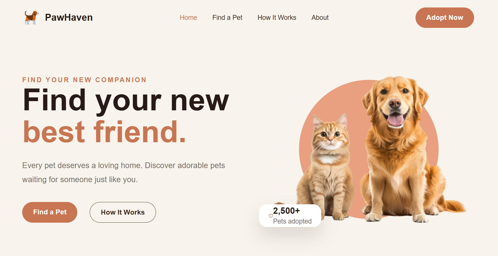
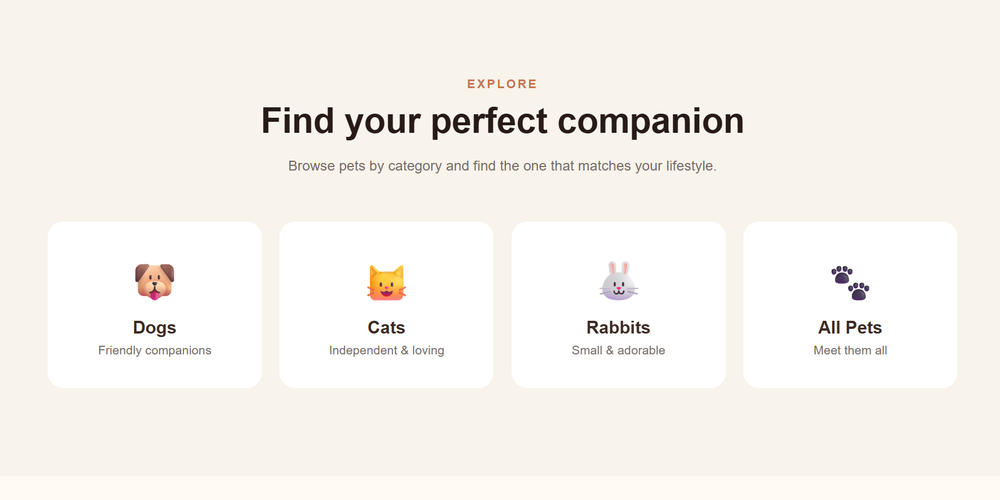
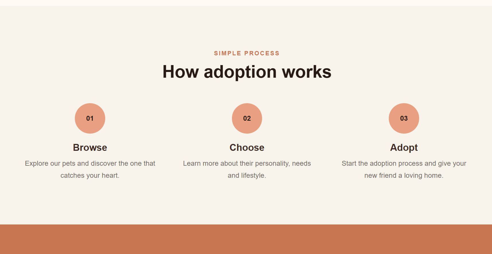
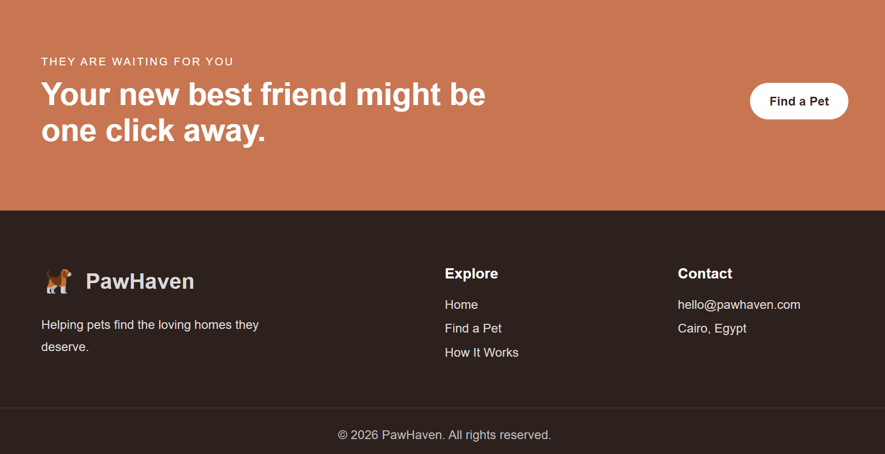

# PawHaven

PawHaven is a frontend-only pet adoption website design. It presents a warm, friendly interface for browsing pets and learning about the adoption process.

## Features

- Responsive landing page
- Pet categories: dogs, cats, rabbits, and all pets
- Pet browsing interface powered by local JSON data
- Adoption process section
- Friendly, editorial visual design
- Local image and asset library

## Technologies

- HTML5
- CSS3
- SCSS source files
- Vanilla JavaScript
- Local JSON data

## Frontend-only project

This project is a visual frontend design and does not include a backend, authentication, database, payment system, or real adoption workflow. The pet data and interactions are for demonstration purposes.

## Screenshots

### Home page

### Pet categories

### Adoption process

### Footer and call to action

## Run locally

Open `index.html` in a browser, or serve the project with any local static server.

For example, with VS Code, install the Live Server extension and open `index.html` with **Open with Live Server**.

## License

This project is licensed under the MIT License. See [LICENSE](LICENSE) for details.
